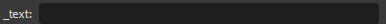
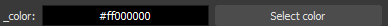

Getting started:
- [Python](https://www.python.org/about/gettingstarted/)
- [OBS Studio Scripting](https://github.com/obsproject/obs-studio/wiki/Getting-Started-With-OBS-Scripting)

Consider cloning this repo and running examples, they are self contained.
Tip: you can create a copy of script, rename it, and add to OBS. So two of identical scripts will be run in parallel with separate namespaces. 
Also check out [issues](https://github.com/upgradeQ/OBS-Studio-Python-Scripting-Cheatsheet-obspython-Examples-of-API/issues)  to report error or have a suggestion and [discussions](https://github.com/upgradeQ/OBS-Studio-Python-Scripting-Cheatsheet-obspython-Examples-of-API/discussions) 
# Table of content 
- [UI](#ui)
- [Property modification](#property-modification)
- [Property additional input](#property-additional-input)
- [obs_data](#obs_data)
- [Print all source settings and filter names](#print-all-source-settings-and-filter-names)
- [Save settings as json](#save-settings-as-json)
- [Source's and filters with identifier string](#sources-and-filters-with-identifier-string)
- [Add source](#add-source)
- [Move source](#move-source)
- [Duplicate source](#duplicate-source)
- [Add filter to source](#add-filter-to-source)
- [Toggle sceneitem visibility](#toggle-sceneitem-visibility)
- [Set current scene](#set-current-scene)
- [Get set order in scene](#get-set-order-in-scene)
- [Add scene with sources to current scene](#add-scene-with-sources-to-current-scene)
- [Events](#events)
- [Program state](#program-state)
- [Signals](#signals)
- [Timers and threads](#timers-and-threads)
- [Hotkeys](#hotkeys)
- [Play sound](#play-sound)
- [Read and write private data from scripts or plugins](#read-and-write-private-data-from-scripts-or-plugins)
- [Browser source interaction](#browser-source-interaction)
- [Browser source receive JSON data](#browser-source-receive-json-data)
- [Access source dB volume level](#access-source-db-volume-level)
- [Get current profile settings via ffi](#get-current-profile-settings-via-ffi)
- [Convert from SWIG type to ctype](#convert-from-swig-type-to-ctype)
- [Set current stream key](#set-current-stream-key)
- [Raw frames](#raw-frames)
- [Debug](#debug)
- [Security](#security)
- [Docs and code examples](#docs-and-code-examples)
- [Changes between versions](#changes-between-versions)
- [Links](#links)
- [Contribute](#contribute)

## UI
|Preview| 
| --- | 
| `S.obs_properties_add_button(props, "button1", "Refresh1:",callback)`  |
|`S.obs_properties_add_bool(props,"_bool","_bool:")`  |
|`S.obs_properties_add_int(props,"_int","_int:",1,100,1)`  |
|`S.obs_properties_add_int_slider(props,"_slider","_slider:",1,100,1) `  |
|`S.obs_properties_add_text(props, "_text", "_text:", S.OBS_TEXT_DEFAULT) `  |
|`S.obs_properties_add_color(props,"_color","_color:") `  |
|`S.obs_properties_add_font(props,"_font","_font:")  `  |
|`S.obs_properties_add_font(props,"_font","_font:")  `  |
|`bool_p = S.obs_properties_add_bool(props, "_obs_bool", "Yes/No"); S.obs_property_set_long_description(bool_p, "Check if yes,else uncheck")`  |


See also :   
https://obsproject.com/docs/reference-properties.html#property-object-functions

## Property modification
```python
def callback(props, prop, *args, **kwargs):  # pass settings implicitly
    p = S.obs_properties_get(props, "button")
    n = next(counter)
    S.obs_property_set_description(p, f"refresh pressed {n} times")
    return True
...
def script_properties():
    props = S.obs_properties_create()
    b = S.obs_properties_add_button(
        props, "button", "refresh pressed 0 times", refresh_pressed
    )
    S.obs_property_set_modified_callback(b, callback)
    return props
```
[Full source](src/property_modification.py)  
See also :  
https://obsproject.com/docs/reference-properties.html#property-modification-functions

## Property additional input 
```python
def callback(props, prop, settings):
    _number = S.obs_data_get_int(settings, "_int")
    _text_value = S.obs_data_get_string(settings, "_text")
    text_property = S.obs_properties_get(props, "_text")
    if _number > 50:
        eg.data = _text_value + str(_number)
        S.obs_property_set_visible(text_property, True)
        return True
    else:
        eg.data = ""
        S.obs_property_set_visible(text_property, False)
        return True
...

def script_properties():  # ui

    ...
    number = S.obs_properties_add_int(props, "_int", "Number", 1, 100, 1)
    text_value = S.obs_properties_add_text(
        props, "_text", "Additional input:", S.OBS_TEXT_DEFAULT
    )
    S.obs_property_set_visible(text_value, False)
    S.obs_property_set_modified_callback(number, callback)
    ...
```
[Full source](src/modification_prop.py)  

Note: properties share similar structure , in Python, Lua, C.
[Example C](https://github.com/obsproject/obs-studio/blob/05c9ddd2293a17717a1bb4189406dfdad79a93e1/plugins/oss-audio/oss-input.c#L626)
See also :  
https://obsproject.com/docs/reference-properties.html#property-modification-functions

## obs_data

- `obs_data_get_string`
- `obs_data_get_int`
- `obs_data_get_double`
- `obs_data_get_bool`
- `obs_data_get_obj`
- `obs_data_get_array`

## Print all source settings and filter names

```python
source = S.obs_get_source_by_name(self.source_name)
settings = S.obs_source_get_settings(source)
psettings = S.obs_source_get_private_settings(source)
dsettings = S.obs_data_get_defaults(settings)
pdsettings = S.obs_data_get_defaults(psettings)
print("[---------- settings ----------")
print(S.obs_data_get_json(settings))
print("---------- private_settings ----------")
print(S.obs_data_get_json(psettings))
print("---------- default settings for this source type ----------")
print(S.obs_data_get_json(dsettings))
print("---------- default private settings for this source type ----------")
print(S.obs_data_get_json(pdsettings))
... 
print("[--------- filter names --------")
for i in range(filter_count):
    settings = S.obs_data_array_item(filters, i)
    filter_name = S.obs_data_get_string(settings, "name")
    S.obs_data_release(settings)
    print(filter_name)
print(" filter names of %s --------" % self.source_name)

```

[Full source](src/print_all_source_settings_and_filter_names.py)  

## Save settings as json

```python
p = Path(__file__).absolute()  # current script path
file = p.parent / "saved_settings.json"
try:
    content = S.obs_data_get_json(Data._settings_)
    with open(file, "w") as f:
        f.write(content)
except Exception as e:
    print(e, "cannot write to file")
```
[Full source](src/save_json_data.py)  
See also :  
https://obsproject.com/docs/reference-settings.html  
https://obsproject.com/docs/scripting.html#getting-the-current-script-s-path  

# Source's and filters with identifier string
To identify with `obs_source_get_unversioned_id` , or creating source/filter.
## Source's
| Name | Source type identifier string |
| --- | --- | 
| Application Audio Capture (BETA) | wasapi_process_output_capture |
| Browser | browser_source | 
| Color Source | color_source |
| Display Capture | monitor_capture |
| Game Capture | game_capture |
| Image Slide Show | slideshow |
| Image | image_source | 
| Media Source | ffmpeg_source |
| Text (GDI+) | text_gdiplus |
| Window Capture | window_capture |
## Filters
| Name | Source type identifier string |
| --- | --- | 
| 3-Band Equalizer | basic_eq_filter |
| Async Delay | async_delay_filter |
| Chroma Key V2 | chroma_key_filter_v2 |
| Chroma Key | chroma_key_filter |
| Color Correction V2 | color_filter_v2 |
| Color Correction | color_filter |
| Color Grade | color_grade_filter |
| Color Key V2 | color_key_filter_v2 |
| Color Key | color_key_filter |
| Compressor | compressor_filter | 
| Crop/Pad | crop_filter | 
| Expander | expander_filter | 
| GPU Delay | gpu_delay_filter | 
| Gain | gain_filter | 
| HDR Tone Mapping (Override) | hdr_tonemap_filter |
| Image Mask/Blend | mask_filter |
| Invert Polarity | invert_polarity_filter |
| Limiter | limiter_filter | 
| Luma Key V2 | luma_key_filter_v2 |
| Luma Key | luma_key_filter |
| Mask V2 | mask_filter_v2 |
| Mask | mask_filter |
| Noise Gate | noise_gate_filter |
| Noise Suppression V2 | noise_suppress_filter_v2 |
| Noise Suppression | noise_suppress_filter |
| Render Delay | gpu_delay |
| Scaling/Aspect Ratio | scale_filter |
| Scroll | scroll_filter | 
| Sharpen V2 | sharpness_filter_v2 | 
| Sharpen | sharpness_filter | 
| Upward Compressor | upward_compressor_filter |
| VST 2.x Plug-in | vst_filter |
| Video Delay (Async) | async_delay_filter |

# Add source
Create source and add it to current scene 
```python
S.obs_data_set_string(settings, "text", "The quick brown fox jumps over the lazy dog")
source = S.obs_source_create_private("text_gdiplus", "test_py", settings)
S.obs_scene_add(scene, source)
```
[Full source](src/source_add.py)  
See also :  
https://obsproject.com/docs/reference-scenes.html

# Move source
Get current scene , get source name, move source to location 
```python
def __init__(self):
    pos = S.vec2()
    self.location = pos
...
def move_text_source(self):
    current_scene = S.obs_frontend_get_current_scene()
    source = S.obs_get_source_by_name("test_py")
    scene = S.obs_scene_from_source(current_scene)
    scene_item = S.obs_scene_find_source(scene, "test_py")
    if scene_item:
        dx, dy = 10, 10
        print("old values", self.location.x)
        S.obs_sceneitem_get_pos(
            scene_item, self.location
        )  # update to last position if its changed from OBS
        self.location.x += dx
        self.location.y += dy
        print("new values", self.location.x)
        S.obs_sceneitem_set_pos(scene_item, self.location)
```
[Full source](src/move_source_.py)

# Duplicate source

```python
 def dup(self):
     current_scene = S.obs_scene_from_source(S.obs_frontend_get_current_scene())
     scene_item = S.obs_scene_find_source(current_scene, self.source_name)
     info = S.obs_transform_info()
     crop = S.obs_sceneitem_crop()
     S.obs_sceneitem_get_info(scene_item,info)
     S.obs_sceneitem_get_crop(scene_item,crop)
     duplicate = S.obs_sceneitem_get_source(scene_item)
     duplicated = S.obs_source_duplicate(
         duplicate, "duplicate" + self.source_name, False
     )

     scenes = S.obs_frontend_get_scenes()
     for scene in scenes:
         name = S.obs_source_get_name(scene)
         if name == self.scene_name:
             scene = S.obs_scene_from_source(scene)
             scene_item2 = S.obs_scene_add(scene, duplicated)
             S.obs_sceneitem_set_info(scene_item2,info)
             S.obs_sceneitem_set_crop(scene_item2,crop)
```
[Full source](src/duplicate_source.py)  

# Add filter to source
Filters are sources,they are not listed in obspython module, you need to know its id from `obs_source_info`
```python
S.obs_data_set_int(settings, "opacity", 50)
source_color = S.obs_source_create_private(
    "color_filter", "opacity to 50", settings
)
S.obs_source_filter_add(source, source_color)
```
[Full source](src/source_filter.py)  
See also :  
[Color correction source](https://github.com/obsproject/obs-studio/blob/c938ea712bce0e9d8e0cf348fd8f77725122b9a5/plugins/obs-filters/color-correction-filter.c#L408)  
https://obsproject.com/docs/reference-sources.html
# Toggle sceneitem visibility
```python
def toggle(self):
    current_scene = S.obs_scene_from_source(S.obs_frontend_get_current_scene())
    scene_item = S.obs_scene_find_source(current_scene, self.source_name)
    boolean = not S.obs_sceneitem_visible(scene_item)
    S.obs_sceneitem_set_visible(scene_item, boolean)
```
[Full source](src/toggle_sceneitem_vis.py)

# Set current scene
```python
def set_current_scene(self):
    scenes = S.obs_frontend_get_scenes()
    for scene in scenes:
        name = S.obs_source_get_name(scene)
        if name == self.scene_name:
            S.obs_frontend_set_current_scene(scene)
...
scenes = S.obs_frontend_get_scenes() # Dropdown menu UI
for scene in scenes:
    name = S.obs_source_get_name(scene)
    S.obs_property_list_add_string(p, name, name) 
```
[Full source](src/get_scene_by_name.py)
# Get set order in scene
```python
def get_order(scene_items=None):
    order = list()
    for i, s in enumerate(scene_items):
        source = S.obs_sceneitem_get_source(s)
        name = S.obs_source_get_name(source)
        order.append({"index": i, "name": name, "scene_item": s})
    return order


def reorder():
    current_scene = S.obs_frontend_get_current_scene()
    with scene_ar(current_scene) as scene:
        with scene_enum(scene) as scene_items:
            order = get_order(scene_items)
            # change second index with pre last
            order[1]["index"], order[-2]["index"] = (
                order[-2]["index"],
                order[1]["index"],
            )
            for s in sorted(order, key=lambda i: i["index"]):
                S.obs_sceneitem_set_order_position(s["scene_item"], s["index"])

```
[Full source](src/change_order.py)

# Add scene with sources to current scene
```python
def add_random_text_source(scene):
    r = " random text # " + str(randint(0, 10))
    with data_ar() as settings:
        S.obs_data_set_string(settings, "text", f"random text value {r}")
        with source_create_ar("text_ft2_source", f"random text{r}", settings) as source:
            pos = S.vec2()
            pos.x = randint(0, 1920)
            pos.y = randint(0, 1080)
            scene_item = S.obs_scene_add(scene, source)
            S.obs_sceneitem_set_pos(scene_item, pos)

def add_scene_with_sources():
    current_scene_source = S.obs_frontend_get_current_scene()
    with scene_from_source_ar(current_scene_source) as scene_source:
        with scene_create_ar("_nested_scene") as _scene:
            py_scene_source = S.obs_scene_get_source(_scene)

            with scene_from_source_ar(py_scene_source) as scene:
                add_random_text_source(scene)
                add_random_text_source(scene)
                add_random_text_source(scene)

            # add created scene to current scene ( nested scene)
            _scene_source = S.obs_scene_get_source(scene)
            S.obs_scene_add(scene_source, _scene_source)
```
Note: sometimes OBS crashes if one of such scenes has been deleted.  
- [Full source](src/add_nested.py)

# Events
```python
def on_event(event):
    if event == S.OBS_FRONTEND_EVENT_SCENE_CHANGED:
        raise Exception("Triggered when the current scene has changed.")


def script_load(settings):
    S.obs_frontend_add_event_callback(on_event)
```
[Full source](src/obs_event_exmpl.py)  
See also:  
https://obsproject.com/docs/reference-frontend-api.html#structures-enumerations  
# Program state
Those functions return true or false :
- `S.obs_frontend_preview_program_mode_active()`
- `S.obs_frontend_replay_buffer_active()`
- `S.obs_frontend_recording_active()`
- `S.obs_frontend_recording_paused()`
- `S.obs_frontend_streaming_active()`
# Signals
[Signals](https://obsproject.com/docs/frontends.html#signals) , [callbacks](https://obsproject.com/docs/reference-libobs-callback.html) , [differences from C](https://obsproject.com/docs/scripting.html#other-differences-from-the-c-api)
## Core signals
```python
sh = S.obs_get_signal_handler()
S.signal_handler_connect(sh,"source_create",callback)
def callback(calldata):
    source = S.calldata_source(cd,"source")
    print(S.obs_source_get_name(source))
```
**source_create**, **source_destroy**, **source_remove**, **source_save**, **source_load**, **source_activate**, **source_deactivate**, **source_show**, **source_hide**, **source_rename**, **source_volume**, **source_transition_start**, **source_transition_video_stop**, **source_transition_stop**, **channel_change**, **master_volume**, **hotkey_layout_change**, **hotkey_register**, **hotkey_unregister**, **hotkey_bindings_changed** 

https://obsproject.com/docs/reference-core.html#core-obs-signals

## Scene signals
```python
def connect_cur_scene():
    source = S.obs_frontend_get_current_scene()
    sh = S.obs_source_get_signal_handler(source)
    S.signal_handler_connect(sh, "item_add", callback)
    S.obs_source_release(source)


def callback(calldata):
    scene_item = S.calldata_sceneitem(calldata, "item")
    #scene = S.calldata_source(cd,"scene") # bad utf symbols 
    scene =  S.obs_sceneitem_get_scene(scene_item)
    name = S.obs_source_get_name
    source = S.obs_sceneitem_get_source
    scene_source = S.obs_scene_get_source
    scene_name = name(scene_source(scene))
    scene_item_name = name(source(scene_item))
    print(f"item {scene_item_name} has been added to scene {scene_name}")
```
- [Full source](src/scene_sig_con.py)

**item_add**, **item_remove**, **reorder**, **refresh**, **item_visible**, **item_locked**, **item_select**, **item_deselect**, **item_transform**

https://obsproject.com/docs/reference-scenes.html#scene-signals
## Source signals 

```python
sh = S.obs_source_get_signal_handler(some_source)
S.signal_handler_connect(sh,"show",callback)
def callback(calldata):
    source = S.calldata_source(cd,"source")
    print("on source show",S.obs_source_get_name(source))
```

**destroy**, **remove**, **save**, **load**, **activate**, **deactivate**, **show**, **hide**, **mute**, **push_to_mute_changed**, **push_to_mute_delay**, **push_to_talk_changed**, **push_to_talk_delay**, **enable**, **rename**, **volume**, **update_properties**, **update_flags**, **audio_sync**, **audio_mixers**, **filter_add**, **filter_remove**, **reorder_filters**, **transition_start**, **transition_video_stop**, **transition_stop**, **media_started**, **media_ended**, **media_pause**, **media_play**, **media_restart**, **media_stopped**, **media_next**, **media_previous**, **update**, **hooked**, **unhooked**

https://obsproject.com/docs/reference-sources.html#source-signals

## Output signals 
```python
def connect_to_rec():
    sh = S.obs_output_get_signal_handler(S.obs_frontend_get_recording_output())
    S.signal_handler_connect(sh, "pause", callback)

def callback(calldata):
    #out = S.calldata_ptr(calldata, "output") # bad type
    print('output paused')
```

**start**, **stop**, **pause**, **unpause**, **starting**, **stopping**, **activate**, **deactivate**, **reconnect**, **reconnect_success**

https://obsproject.com/docs/reference-outputs.html#output-signals

# Timers and threads

```python
def script_update(settings):
    eg.source_name = S.obs_data_get_string(settings, "source")
    S.timer_remove(eg.update_text)
    if eg.source_name != "":
        S.timer_add(eg.update_text, 1 * 1000)
```
[Full source](src/example_class.py)  
Note: each time script updated it's removed first  
See also :   
[Version](src/start_stop_timer.py) with globals and only one timer allowed.  
https://obsproject.com/docs/scripting.html#script-timers  
## Thread
```python
def callback(pressed):
    if pressed:
        toggle_thread()


def busy_thread():
    while True:
        if not data.thread_paused:
            sleep(0.02)
            data.status = "active"
            # print to stdoud crashes OBS on exit
        else:
            sleep(0.5)
            data.status = "inactive"


print('Press the "~" to toggle on/off')
hook("OBS_KEY_ASCIITILDE", "id_", callback)
S.timer_add(lambda: print(data.status), 500)
t = threading.Thread(target=busy_thread)
t.start()
```
- [Full source](src/busy_thread.py)

# Hotkeys
This hotkey example will create hotkeys in settings , but you need to bind it manually.
```python
class Hotkey:
    def __init__(self, callback, obs_settings, _id):
        self.obs_data = obs_settings
        self.hotkey_id = S.OBS_INVALID_HOTKEY_ID
        self.hotkey_saved_key = None
        self.callback = callback
        self._id = _id

        self.load_hotkey()
        self.register_hotkey()
        self.save_hotkey()

...

class h:
    htk_copy = None  # this attribute will hold instance of Hotkey

...
h1 = h()
h2 = h()
...
def script_load(settings):
    h1.htk_copy = Hotkey(cb1, settings, "h1_id")
    h2.htk_copy = Hotkey(cb2, settings, "h2_id")


def script_save(settings):
    h1.htk_copy.save_hotkey()
    h2.htk_copy.save_hotkey()
```
This hotkey example will create hotkeys on fly from json settings , but you need to know internal id.
```python
ID = "htk_id"
JSON_DATA = '{"%s":[{"key":"OBS_KEY_1"}]}' % ID

def on_obs_key_1(pressed):
    if pressed:
        raise Exception("hotkey 1 pressed")

def script_load(settings):
    s = S.obs_data_create_from_json(JSON_DATA)
    a = S.obs_data_get_array(s, ID)
    h = S.obs_hotkey_register_frontend(ID, ID, on_obs_key_1)
    S.obs_hotkey_load(h, a)
```
Here is how send hotkey to OBS

```python
def send_hotkey(obs_htk_id, key_modifiers=None):
    if key_modifiers:
        shift = key_modifiers.get("shift")
        control = key_modifiers.get("control")
        alt = key_modifiers.get("alt")
        command = key_modifiers.get("command")
    ...
    combo = S.obs_key_combination()
    combo.modifiers = modifiers
    combo.key = S.obs_key_from_name(obs_htk_id)
    ...
    S.obs_hotkey_inject_event(combo, False)
    S.obs_hotkey_inject_event(combo, True)
    S.obs_hotkey_inject_event(combo, False)
```

- [Full source](src/obs_httkeys.py) 
- [Example with json](src/hotkey_json.py)
- [Example with send hotkey](src/send_hotkey.py)
- [Example with global ](src/hotkey_exmpl.py) - The use of `global` is not recommended as it reduces readability.
- [Example with many hotkeys](src/hotkey_many.py) - Implementation of keyboard, easily add many hotkeys to the program.

See also:
https://github.com/obsproject/obs-studio/blob/master/libobs/obs-hotkeys.h
https://github.com/Palakis/obs-websocket/pull/595

# Play sound
```python
def play_sound():
    ...
    mediaSource = S.obs_source_create_private(
        "ffmpeg_source", "Global Media Source", None
    )
    s = S.obs_data_create()
    S.obs_data_set_string(s, "local_file", script_path() + "alert.mp3")
    S.obs_source_update(mediaSource, s)
    S.obs_source_set_monitoring_type(
        mediaSource, S.OBS_MONITORING_TYPE_MONITOR_AND_OUTPUT
    )
    ...
```
- [Full source](src/play_sound_globally.py)

# Read and write private data from scripts or plugins
Write in one script
```python 
def send_to_private_data(data_type, field, result):
    settings = S.obs_data_create()
    set = getattr(obs, f"obs_data_set_{data_type}")
    set(settings, field, result)
    S.obs_apply_private_data(settings)
    S.obs_data_release(settings)

def write_private_data():
    result = "private value from " + str(__file__) + " " + str(randint(1, 10))
    send_to_private_data("string", "__private__", result)
```
Read from another 
```python
@contextmanager
def p_data_ar(data_type, field):
    settings = S.obs_get_private_data()
    get = getattr(obs, f"obs_data_get_{data_type}")
    try:
        yield get(settings, field)
    finally:
        S.obs_data_release(settings)

def print_private_data():
    with p_data_ar("string", "__private__") as value:
        print(value)
```
Lua is also supported
```lua
local obs = obslua
local settings = S.obs_data_create()
S.obs_data_set_int(settings,"__private__", 7)
S.obs_apply_private_data(settings)
S.obs_data_release(settings)
```

- [Full example read](src/read_private_data.py)
- [Full example write](src/write_private_data.py) 

# Browser source interaction
```python
def send_hotkey_to_browser(source, obs_htk_id, key_modifiers=None, key_up=False):

    key = S.obs_key_from_name(obs_htk_id)
    vk = S.obs_key_to_virtual_key(key)
    event = S.obs_key_event()
    event.native_vkey = vk
    event.modifiers = get_modifiers(key_modifiers)
    event.native_modifiers = event.modifiers  # https://doc.qt.io/qt-5/qkeyevent.html
    event.native_scancode = vk
    event.text = ""
    S.obs_source_send_key_click(source, event, key_up)


def press_tab(*p):
    with source_auto_release(G.source_name) as source:
        send_hotkey_to_browser(source, "OBS_KEY_TAB")
        send_hotkey_to_browser(source, "OBS_KEY_TAB", key_up=True)


def press_shift_tab(*p):
    with source_auto_release(G.source_name) as source:
        send_hotkey_to_browser(source, "OBS_KEY_TAB", {"shift": True})
        send_hotkey_to_browser(source, "OBS_KEY_TAB", {"shift": True}, key_up=True)

```
- [Full source](src/browser_source_interaction.py)

# Browser source receive JSON data
```python
cd = S.calldata_create()
ph = S.obs_source_get_proc_handler(source)
S.calldata_set_string(cd, "eventName", "my-test-event")
S.calldata_set_string(cd, "jsonString", '{"key123": "\\nvalue123"}')
S.proc_handler_call(ph, "javascript_event", cd)
S.calldata_destroy(cd)
```

Page source code, currently has no permission requirements. 

```javascript

<!DOCTYPE html>

<body style="background-color:aquamarine;">
   <h1>HTML h1 in body element</h1>
</body>

<script type="text/javascript">
  window.addEventListener('my-test-event', function(event) {
    document.body.innerHTML +=(event.detail['key123']);
  })
</script>
```


- [Full source](src/browser_source_json.py)

# Access source dB volume level
There is FFI `ctypes` module in Python to wrap native `obs` lib.
However,to run it on GNU/Linux you must start obs with `LD_PRELOAD`.
```bash
ubsdrive3@usbdrive3:~$ LD_PRELOAD=/usr/lib/x86_64-linux-gnu/libpython3.9.so obs
```
It might be in different directory, use `find /usr -name 'libpython*' ` to
find exact location.

```python
volmeter_callback_t = CFUNCTYPE(
    None, c_void_p, POINTER(c_float), POINTER(c_float), POINTER(c_float)
)
...
wrap(
    "obs_volmeter_add_callback",
    None,
    argtypes=[POINTER(Volmeter), volmeter_callback_t, c_void_p],
)
...
@volmeter_callback_t
def volmeter_callback(data, mag, peak, input):
    G.noise = float(peak[0])
```

- [Full source](src/volmeter_via_ffi.py)

# Get current profile settings via ffi

```python
wrap("obs_frontend_get_profile_config", POINTER(Config), use_lib=G.obsffi_front)
# const char *config_get_string(config_t *config, const char *section,
#                  const char *name)
wrap("config_get_string", c_char_p, argtypes=[POINTER(Config), c_char_p, c_char_p])
wrap("config_num_sections", c_size_t, argtypes=[POINTER(Config)])
wrap("config_get_section", c_char_p, argtypes=[POINTER(Config), c_size_t])


def output_to_stdout():
    cfg = G.obs_frontend_get_profile_config()
    e = lambda x: x.encode("utf-8")
    s = G.config_get_string(cfg, e("SimpleOutput"), e("FilePath"))
    l = G.config_num_sections(cfg)
    for i in range(l):
        tag = G.config_get_section(cfg, c_size_t(i))
    print(s, l)
```
- [Full source](src/get_config_via_ffi.py)

# Convert from SWIG type to ctype
```python
cfg = cast(
    c_void_p(int(S.obs_frontend_get_profile_config())), POINTER(Config)
)
```

Note,that this uses `obspython.obs_frontend_get_profile_config` so there is no need to load additional libraries and write glue ctypes code.

# Set current stream key
```python 
service = S.obs_frontend_get_streaming_service()
settings = S.obs_service_get_settings(service)
S.obs_data_set_string(settings, "key", _G._my_key)
S.obs_service_update(service, settings)
S.obs_data_release(settings)
S.obs_frontend_save_streaming_service()
```
- [Full source](src/stream_key.py)

# Raw frames
It is possible to grab raw frame from source see: [Get video frames programmatically](src/get_source_frame_data_ffi.py) - this is a viable option if you want check frame data in memory, with no plugins or recompilation.
Other methods:
- [`obs-screenshot-plugin`](https://github.com/synap5e/obs-screenshot-plugin/issues/47) Fork + Windows only, it has `Output to Named Shared Memory Output` among other things.
- [`obs-virtualcam`](https://obsproject.com/forum/resources/obs-virtualcam.1744/) Plugin, read webcam frames, [related](https://github.com/obsproject/obs-studio/issues/3635)
- [`obs-rs`](https://github.com/not-matthias/obs-rs) - Uses the decoupled hook implementation of OBS Studio, written in Rust, uses Windows API, possible to port to Python ctypes.
- [`DXcam`](https://github.com/ra1nty/DXcam/issues/100) - Current maintained standalone DirectX high performance screen capture written in Python ctypes. 

# Debug
There is no stdin therefore you can't use pdb , options are:
- :star: using `print`
- using generated log file (contains information about memory leaks), also accessible via Help>Log Files>View Current Log
- using pycharm remote debugging (localhost)
- using [vscode](https://code.visualstudio.com/docs/python/debugging) attach to the process:
    - Load python extension
    - open script file , `pip install debugpy` , place  `debugpy.breakpoint()` somewhere
        - Run (F5) select configuration ( Attach using Process ID)
        - select obs (on windows `obs64.exe`)
        - View  select Debug Console (ctrl+shift+y) 
- [Example debugpy obs ](src/debug_exmpl.py)

  

# Security
- "Calling home" - see [`#4044`](https://github.com/obsproject/obs-studio/issues/4044)
- On GNU/Linux there is handy program called `tcpdump`, to run a check against OBS Studio - use this command (it is active on 443 port on start and on end)
```bash
# tcpdump -i <your_interface_e_g_wifi_or_wire> 'port 443'
```
- Avoid using `sudo` or admin, check hashsums, do backups, do updates, setup a firewall, do hardening, etc...
- There is no confirmation for loading Lua or Python scripts - they can be added/overwritten via .json key
- Also solutions for Python source code obfuscation & loading from shared (compiled) library do exist. Applying that will make it a bit harder to reverse-engineer your private code.
- Legal info (trademark) [link](https://www.trademarkelite.com/trademark/trademark-owner/Wizards%20of%20OBS%20LLC)
- Privacy policy - https://obsproject.com/privacy-policy  - keyword *downlodable software*

# Docs and code examples

- [`Generated export.md`](src/export.md)

Contains all variables and functions available in `obspython` formatted with markdown. Table consist of links to appropriate search terms in OBS Studio repository, links to scripts in `obspython` and `obslua` with each script within GitHub code search.`gs_*` and `matrix_*` functions exluded from that table.
[Export names](src/export_md.py)  

- [`Generated export including graphics index.csv`](src/export_all.csv) - All variable and function exports.
- [`Generated export libobs for ctypes index.csv`](src/dumps_libobs.csv) - Created using `dumpbin` tool with this command `.\dumpbin /exports "C:\Program Files\obs-studio\bin\64bit\obs.dll"` 

# Changes between versions
* 28.0.0 version - Most Python 3 versions will work now, so there is no restriction to 3.6.8
* 28.0.0 version - NO support for Windows 7 & 8, macOS 10.13 & 10.14, Ubuntu 18.04 and all 32-bit operating systems
* 28.0.0 version - Added native support for websocket 
* 30.0.0 version - Python 3.11 support for Windows and mac OS
* 30.0.0 version - Lua binary libraries loading
* 30.1.0 version - Premultiplied Alpha option for game capture on Windows

# Links
- [Scripts forum](https://obsproject.com/forum/resources/categories/scripts.5/) , [Github topic `obs-scripts`](https://github.com/topics/obs-scripts) , [Github topic `obs-script`](https://github.com/topics/obs-script)
- [Awesome OBS Studio collection](https://github.com/rse/obs-setup)
- [OBS Studio Repo](https://github.com/obsproject/obs-studio) , [obs-scripting-python.c](https://github.com/obsproject/obs-studio/blob/master/deps/obs-scripting/obs-scripting-python.c)
- [Docs](https://obsproject.com/docs/) , [Docs/scripting](https://obsproject.com/docs/scripting.html) , [Docs/plugins](https://obsproject.com/docs/plugins.html) , [Docs index](https://obsproject.com/docs/genindex.html)
- obspython [Gist](https://gist.github.com/search?l=Python&q=obspython&s=updated) , [Github](https://github.com/search?l=Python&o=desc&q=obspython&s=indexed&type=Code) , [grep.app](https://grep.app/search?q=obspython&filter[lang][0]=Python)
- obslua [Gist](https://gist.github.com/search?l=Lua&o=desc&q=obslua&s=updated) , [Github](https://github.com/search?l=Lua&o=desc&q=obslua&s=indexed&type=Code) , [grep.app](https://grep.app/search?q=obslua&filter[lang][0]=Lua)
- [A Python bundle for integration with OBS scripting](https://github.com/zooba/obs-python)
- [Lua tips and tricks](https://obsproject.com/forum/threads/tips-and-tricks-for-lua-scripts.132256/)
- [Python 3.11.9, 64-bit installer, for Microsoft Windows](https://www.python.org/downloads/release/python-3119/)
# Contribute
Something missing? Write a PR!
