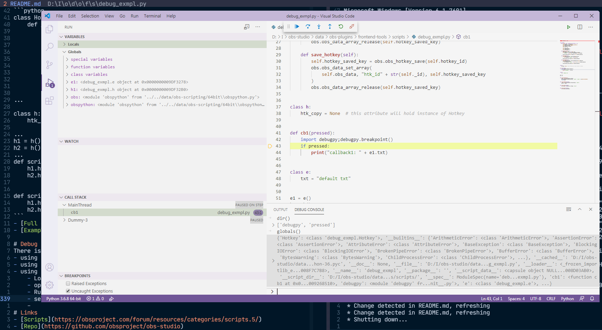

# Шпаргалка по сценариям на Python в OBS Studio
- `obspython` Примеры сценариев OBS Studio API.Obs в `/src` 
- Каждый пример сценария obs в основном будет работать с *существующим* текстовым источником
- Есть возможность дублировать скрипты и повторно добавлять их в OBS (имена должны быть разными)
# Оглавление 
- [Использование классов](#using-classes)
- [с заявлением](#with-statement)
- [Передача аргументов обратным вызовам](#passing-arguments-to-callbacks)
- [Пользовательский интерфейс](#ui)
- [Модификация собственности](#property-modification)
- [Дополнительный ввод](#additional-input)
- [obs_data](#obs_data)
- [сохранить настройки как json](#save-settings-as-json)
- [Источники и фильтры со строкой идентификатора](#sources-and-filters-with-identifier-string)
- [Добавить источник](#add-source)
- [Переместить источник](#move-source)
- [Добавить фильтр к источнику](#add-filter-to-source)
- [Переключить видимость источника](#toggle-source-visibility)
- [Установить текущую сцену](#set-current-scene)
- [Установите порядок в сцене](#get-set-order-in-scene)
- [События](#events)
- [Состояние программы](#program-state)
- [Время (последовательные примитивы) ](#timing-sequential-primitives)
- [Горячие клавиши](#hotkeys)
- [Отлаживать](#debug)
- [Ссылки](#links)
- [Делать вклад](#contribute)

## Использование классов 
```python
class Example:
    def __init__(self,source_name=None):
        self.source_name = source_name

    def update_text(self):
        source = obs.obs_get_source_by_name(self.source_name)
        if source is not None:
            data = str(next(datacycle))
            settings = obs.obs_data_create()
            obs.obs_data_set_string(settings, "text", data)
            obs.obs_source_update(source, settings)
            obs.obs_data_release(settings)
            obs.obs_source_release(source)
```
[Полный пример](src/example_class.py)  

Или более компактный:  
```python
class _G:
    source_name = ''
    data = None
    flag = False

G = _G()

def script_update(settings):
    G.source_name = ...
    if G.flag:
        pass
```

## с заявлением 
Автоматически выпускать .

```python
@contextmanager
def source_auto_release(source_name):
    source = obs.obs_get_source_by_name(source_name)
    try:
        yield source 
    finally:
        obs.obs_source_release(source)
...
# usage
with source_auto_release(self.source_name) as source:
    if source is not None:
        data = str(next(datacycle))
        with data_auto_release() as settings:
            obs.obs_data_set_string(settings, "text", data)
            obs.obs_source_update(source, settings)
```
[Полный пример](src/with_stmt.py)  
Смотрите также :   
https://docs.python.org/3/library/contextlib.html#contextlib.contextmanager
## Передача аргументов обратным вызовам
```python
from functools import partial
...
flag = obs.obs_data_get_bool(settings,"_obs_bool")
eg.update_text = partial(eg.update_text,flag_func=flag)
...
```
[Полный пример](src/callback_partial.py)
## UI
|код   | результат  |
| ---   | ---     |
|`obs.obs_properties_add_button(props, "button1", "Refresh1:",callback)` |  |
|`obs.obs_properties_add_bool(props,"_bool","_bool:")` |  |
|`obs.obs_properties_add_int(props,"_int","_int:",1,100,1)` |  |
|`obs.obs_properties_add_int_slider(props,"_slider","_slider:",1,100,1) ` |  |
|`obs.obs_properties_add_text(props, "_text", "_text:", obs.OBS_TEXT_DEFAULT) ` |  |
|`obs.obs_properties_add_color(props,"_color","_color:") ` |  |
|`obs.obs_properties_add_font(props,"_font","_font:")  `|   |

Смотрите также :   
https://obsproject.com/docs/reference-properties.html#property-object-functions

## Модификация собственности
```python
def callback(props, prop, *args, **kwargs):  # передать настройки неявно
    p = obs.obs_properties_get(props, "button")
    n = next(counter)
    obs.obs_property_set_description(p, f"refresh pressed {n} times")
    return True
...
def script_properties():
    props = obs.obs_properties_create()
    b = obs.obs_properties_add_button(
        props, "button", "refresh pressed 0 times", refresh_pressed
    )
    obs.obs_property_set_modified_callback(b, callback)
    return props
```
[Полный пример](src/property_modification.py)  
Смотрите также : 
https://obsproject.com/docs/reference-properties.html#property-modification-functions

## Дополнительный ввод 
```python
def callback(props, prop, settings):
    _number = obs.obs_data_get_int(settings, "_int")
    _text_value = obs.obs_data_get_string(settings, "_text")
    text_property = obs.obs_properties_get(props, "_text")
    if _number > 50:
        eg.data = _text_value + str(_number)
        obs.obs_property_set_visible(text_property, True)
        return True
    else:
        eg.data = ""
        obs.obs_property_set_visible(text_property, False)
        return True
...

def script_properties():  # ui

    ...
    number = obs.obs_properties_add_int(props, "_int", "Number", 1, 100, 1)
    text_value = obs.obs_properties_add_text(
        props, "_text", "Additional input:", obs.OBS_TEXT_DEFAULT
    )
    obs.obs_property_set_visible(text_value, False)
    obs.obs_property_set_modified_callback(number, callback)
    ...
```
[Полный пример](src/modification_prop.py)  
Смотрите также : 
https://obsproject.com/docs/reference-properties.html#property-modification-functions

## obs_data

- `obs_data_get_string`
- `obs_data_get_int`
- `obs_data_get_double`
- `obs_data_get_bool`
- `obs_data_get_obj`
- `obs_data_get_array`

 Introspection of `obspython`: 
```python
    ...
    data = vars(obs)
    with open('export1.txt','w') as f:
        pprint(data,stream=f,width=100)
    ...

```
[Полный пример](src/export_vars.py)  
[Generated export1.txt](src/export1.txt) содержит все переменные, доступные в `obspython`  

Примечание: свойства имеют аналогичную структуру в Python, Lua, C.
[Пример C](https://github.com/obsproject/obs-studio/blob/05c9ddd2293a17717a1bb4189406dfdad79a93e1/plugins/oss-audio/oss-input.c#L626)

## Сохранить настройки как json

```python
p = Path(__file__).absolute()  # текущий путь к скрипту
file = p.parent / "saved_settings.json"
try:
    content = obs.obs_data_get_json(Data._settings_)
    with open(file, "w") as f:
        f.write(content)
except Exception as e:
    print(e, "cannot write to file")
```
[Полный пример](src/save_json_data.py)  
Смотрите также : 
https://obsproject.com/docs/reference-settings.html  
https://obsproject.com/docs/scripting.html#getting-the-current-script-s-path  

# Источники и фильтры со строкой идентификатора
Чтобы идентифицировать себя с `obs_source_get_unversioned_id` , или создание источника / фильтра.
## Источник
| название | Строка идентификатора исходного типа |
| --- | --- | 
| Browser | browser_source | 
| Color Source | color_source |
| Display Capture | monitor_capture |
| Game Capture | game_capture |
| Image | image_source | 
| Image Slide Show | slideshow |
| Media Source | ffmpeg_source |
| Text (GDI+) | text_gdiplus |
| Window Capture | window_capture |
## Фильтры
| название | Строка идентификатора исходного типа |
| --- | --- | 
| Compressor | compressor_filter | 
| Expander | expander_filter | 
| Gain | gain_filter | 
| Invert Polarity | invert_polarity_filter |
| Limiter | limiter_filter | 
| Noise Gate | noise_gate_filter |
| Noise Suppression | noise_suppress_filter |
| VST 2.x Plug-in | vst_filter |
| Video Delay (Async) | async_delay_filter |
| Chroma Key | chroma_key_filter |
| Color Correction | color_filter |
| Color Key | color_key_filter |
| Crop/Pad | crop_filter | 
| Image Mask/Blend | mask_filter |
| Luma Key | luma_key_filter |
| Render Delay | gpu_delay |
| Scaling/Aspect Ratio | scale_filter |
| Scroll | scroll_filter | 
| Sharpen | sharpness_filter | 


# Добавить источник
Создать источник и добавить его в текущую сцену 
```python
obs.obs_data_set_string(settings, "text", "The quick brown fox jumps over the lazy dog")
source = obs.obs_source_create_private("text_gdiplus", "test_py", settings)
obs.obs_scene_add(scene, source)
```
[Полный пример](src/source_add.py)  
Смотрите также : 
https://obsproject.com/docs/reference-scenes.html

# Переместить источник
Получить текущую сцену, получить имя источника, переместить источник в местоположение 
```python
def __init__(self):
    pos = obs.vec2()
    self.location = pos
...
def move_text_source(self):
    current_scene = obs.obs_frontend_get_current_scene()
    source = obs.obs_get_source_by_name("test_py")
    scene = obs.obs_scene_from_source(current_scene)
    scene_item = obs.obs_scene_find_source(scene, "test_py")
    if scene_item:
        dx, dy = 10, 10
        print("old values", self.location.x)
        obs.obs_sceneitem_get_pos(
            scene_item, self.location
        )  # update to last position if its changed from OBS
        self.location.x += dx
        self.location.y += dy
        print("new values", self.location.x)
        obs.obs_sceneitem_set_pos(scene_item, self.location)
```
[Полный пример](src/move_source_.py)
# Добавить фильтр к источнику
Фильтры - это источники, они не указаны в модуле obspython, вам нужно знать его идентификатор из `obs_source_info`
```python
obs.obs_data_set_int(settings, "opacity", 50)
source_color = obs.obs_source_create_private(
    "color_filter", "opacity to 50", settings
)
obs.obs_source_filter_add(source, source_color)
```
[Полный пример](src/source_filter.py)  
See also :  
[Источник коррекции цвета](https://github.com/obsproject/obs-studio/blob/c938ea712bce0e9d8e0cf348fd8f77725122b9a5/plugins/obs-filters/color-correction-filter.c#L408)  
https://obsproject.com/docs/reference-sources.html
# Переключить видимость источника
```python
def toggle(self):
    current_scene = obs.obs_scene_from_source(obs.obs_frontend_get_current_scene())
    scene_item = obs.obs_scene_find_source(current_scene, self.source_name)
    boolean = not obs.obs_sceneitem_visible(scene_item)
    obs.obs_sceneitem_set_visible(scene_item, boolean)
```
[Полный пример](src/toggle_source_vis.py)

# Установить текущую сцену
```python
def set_current_scene(self):
    scenes = obs.obs_frontend_get_scenes()
    for scene in scenes:
        name = obs.obs_source_get_name(scene)
        if name == self.scene_name:
            obs.obs_frontend_set_current_scene(scene)
...
scenes = obs.obs_frontend_get_scenes() # Выпадающее меню UI
for scene in scenes:
    name = obs.obs_source_get_name(scene)
    obs.obs_property_list_add_string(p, name, name) 
```
[Full example](src/get_scene_by_name.py)
# Установите порядок в сцене
```python
def get_order(scene_items=None):
    order = list()
    for i, s in enumerate(scene_items):
        source = obs.obs_sceneitem_get_source(s)
        name = obs.obs_source_get_name(source)
        order.append({"index": i, "name": name, "scene_item": s})
    return order


def reorder():
    current_scene = obs.obs_frontend_get_current_scene()
    with scene_ar(current_scene) as scene:
        with scene_enum(scene) as scene_items:
            order = get_order(scene_items)
            # change second index with pre last
            order[1]["index"], order[-2]["index"] = (
                order[-2]["index"],
                order[1]["index"],
            )
            for s in sorted(order, key=lambda i: i["index"]):
                obs.obs_sceneitem_set_order_position(s["scene_item"], s["index"])

```
[Полный пример](src/change_order.py)

# События
```python
def on_event(event):
    if event == obs.OBS_FRONTEND_EVENT_SCENE_CHANGED:
        raise Exception("Срабатывает при изменении текущей сцены.")


def script_load(settings):
    obs.obs_frontend_add_event_callback(on_event)
```
[Полный пример](src/obs_event_exmpl.py)  
Смотрите также: 
https://obsproject.com/docs/reference-frontend-api.html#structures-enumerations  
# Состояние программы
Эти функции возвращают истину или ложь:
- `obs.obs_frontend_preview_program_mode_active()`
- `obs.obs_frontend_replay_buffer_active()`
- `obs.obs_frontend_recording_active()`
- `obs.obs_frontend_recording_paused()`
- `obs.obs_frontend_streaming_active()`

# Время (последовательные примитивы)

```python
def script_update(settings):
    eg.source_name = obs.obs_data_get_string(settings, "source")
    obs.timer_remove(eg.update_text)
    if eg.source_name != "":
        obs.timer_add(eg.update_text, 1 * 1000)
```
[Full example](src/example_class.py)  
Примечание: каждый раз, когда скрипт обновляется, он сначала удаляется 
Смотрите также : 
[Версия](src/start_stop_timer.py) с глобальными объектами и разрешен только один таймер. 
https://obsproject.com/docs/scripting.html#script-timers  

# Горячие клавиши
Этот пример горячих клавиш создаст горячие клавиши в настройках, но вам нужно привязать их вручную.
```python
class Hotkey:
    def __init__(self, callback, obs_settings, _id):
        self.obs_data = obs_settings
        self.hotkey_id = obs.OBS_INVALID_HOTKEY_ID
        self.hotkey_saved_key = None
        self.callback = callback
        self._id = _id

        self.load_hotkey()
        self.register_hotkey()
        self.save_hotkey()

...

class h:
    htk_copy = None # этот атрибут будет содержать экземпляр Hotkey

...
h1 = h()
h2 = h()
...
def script_load(settings):
    h1.htk_copy = Hotkey(cb1, settings, "h1_id")
    h2.htk_copy = Hotkey(cb2, settings, "h2_id")


def script_save(settings):
    h1.htk_copy.save_hotkey()
    h2.htk_copy.save_hotkey()
```
Этот пример горячих клавиш будет создавать горячие клавиши на лету из настроек json, но вам нужно знать внутренний идентификатор.
```python
ID = "htk_id"
JSON_DATA = '{"%s":[{"key":"OBS_KEY_1"}]}' % ID

def on_obs_key_1(pressed):
    if pressed:
        raise Exception("горячая клавиша 1 нажата")

def script_load(settings):
    s = obs.obs_data_create_from_json(JSON_DATA)
    a = obs.obs_data_get_array(s, ID)
    h = obs.obs_hotkey_register_frontend(ID, ID, on_obs_key_1)
    obs.obs_hotkey_load(h, a)
```
- [Полный пример](src/obs_httkeys.py) 
- [Пример с глобальным ](src/hotkey_exmpl.py)
- [Полный пример с json](src/hotkey_json.py)  

Смотрите также: 
https://github.com/obsproject/obs-studio/blob/master/libobs/obs-hotkeys.h

# Отлаживать
Нет стандартного ввода, поэтому вы не можете использовать pdb, варианты:
- с помощью `print`
- с использованием удаленной отладки pycharm (localhost)
- с помощью [vscode](https://code.visualstudio.com/docs/python/debugging) прикрепить к процессу:
    - Загрузить расширение Python
    - oфайл сценария pen, `pip install debugpy`, поместите где-нибудь`debugpy.breakpoint()`
        - Запустите (F5) выберите конфигурацию (Присоединить с помощью идентификатора процесса)
        - выбрать obs (в windows `obs64.exe`)
        - Просмотр выберите консоль отладки (ctrl + shift + y)
- [Пример debugpy obs ](src/debug_exmpl.py)

  

# Ссылки
- [Скрипты](https://obsproject.com/forum/resources/categories/scripts.5/)
- [Репо](https://github.com/obsproject/obs-studio)
- [Документы](https://obsproject.com/docs/) , [Документы / скрипты](https://obsproject.com/docs/scripting.html) , [Указатель документов](https://obsproject.com/docs/genindex.html)
- [Gist](https://gist.github.com/search?l=Python&q=obspython)
- [Github](https://github.com/search?l=Python&o=desc&q=obspython&s=indexed&type=Code)
# Делать вклад
Пожертвования приветствуются!
